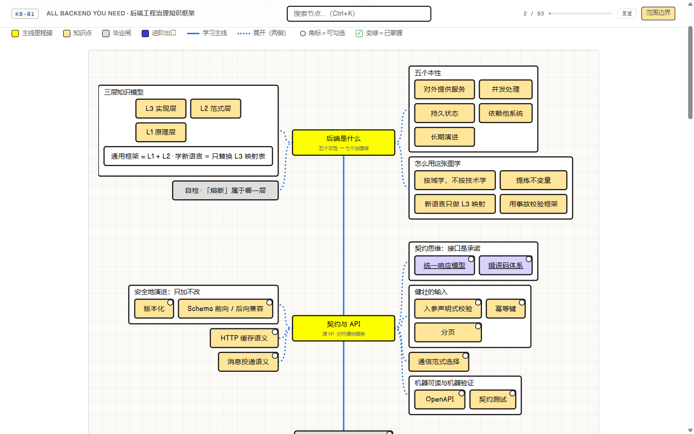
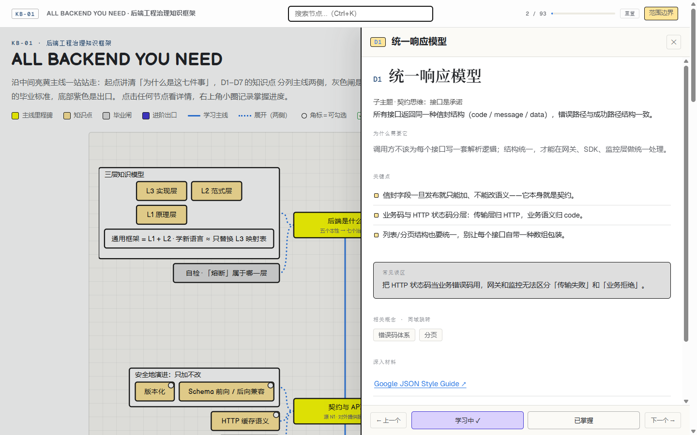

# ALL BACKEND YOU NEED — A Backend Governance Knowledge Framework

[](./LICENSE)
[](https://github.com/Decent9967/all-backend-you-need/actions/workflows/ci.yml)
[](https://decent9967.github.io/all-backend-you-need/)
[](https://github.com/Decent9967/all-backend-you-need/releases)

English | [简体中文（完整版）](./README.zh-CN.md)

**[Open online →](https://decent9967.github.io/all-backend-you-need/)**

An interactive learning roadmap (single-page Next.js app) inspired by the
visual language and knowledge organization of [roadmap.sh](https://roadmap.sh):
a hand-drawn canvas with a central milestone spine, sub-topic groups on both
sides, and a graduation gate at the end of every domain.





## The idea: learn by domain, not by technology

Most backend roadmaps are tool checklists that expire with your stack. This
one derives **seven governance domains** from the five inescapable "natures"
of backend systems — serving an untrusted network, handling concurrency,
persisting state, depending on other systems, and evolving for years — and
states each domain's **invariants**: assertions that hold in any language,
any framework.

| Domain | Focus |
|---|---|
| D1 Contracts & APIs | Interfaces are promises; errors, versions and caching are part of the contract |
| D2 Concurrency & Consistency | Races, state machines, isolation levels, locks, distributed transactions |
| D3 Data & State | Modeling, money & time, indexes, replication, zero-downtime migration |
| D4 Distributed Resilience | Timeouts, retries, circuit breakers, backpressure, graceful shutdown |
| D5 Observability | Structured logs, tracing, RED metrics, SLOs, alerting, postmortems |
| D6 Security | AuthN/AuthZ, secrets, injection, IDOR, least privilege |
| D7 Engineering Governance | Boundaries, code review, CI/CD, tech debt, on-call, ADRs |

## What each node gives you

- **84 concept nodes**, each a one-page note: one-line definition / why it
  exists / key points / common pitfalls / related concepts / curated primary
  sources — **106 verified external links** (RFCs, Google SRE, OWASP,
  martinfowler.com, PoEAA, 12-Factor, NIST …)
- **7 graduation gates**: recite the invariants from memory, then answer one
  retrieval-practice question per domain
- **Progress tracking**: three-state (learning / mastered), persisted in
  localStorage; keyboard navigation (← →, Esc), in-page search (Ctrl+K),
  shareable deep links (`#/d2-c0`) that scroll & flash the node
- A **scope registry** of explicitly out-of-scope topics with revisit
  conditions — decisions are documented, not lost

## Language

The whole app is bilingual via the toggle in the top bar: node titles, the
84 concept notes, 31 invariants, all gate quizzes, the scope registry, the
exit views (calibration tree / decision flow) and every concept-map diagram.
Primary sources remain in their original language. PRs welcome.

## Quick start

```bash
npm install
npm run dev     # http://localhost:3000
npm run build && npm start
```

## Repository layout

```
app/ + components/        UI shell and canvas renderer (roadmap.sh-style)
data/roadmap.ts           canvas data (teaching order, three-line layout)
data/notes.ts             per-node notes (88 concepts, primary-source links)
data/framework.ts         knowledge content (domains, invariants, reading lists)
data/scope.ts             scope registry (explicit non-goals + revisit rules)
scripts/                  audits: note↔concept integrity, link liveness
```

## Contributing & releases

See [CONTRIBUTING.md](./CONTRIBUTING.md). Versions are tagged
[vX.Y.Z](https://github.com/Decent9967/all-backend-you-need/releases);
every push to `main` runs CI and redeploys the live site.

## License

[MIT](./LICENSE)
